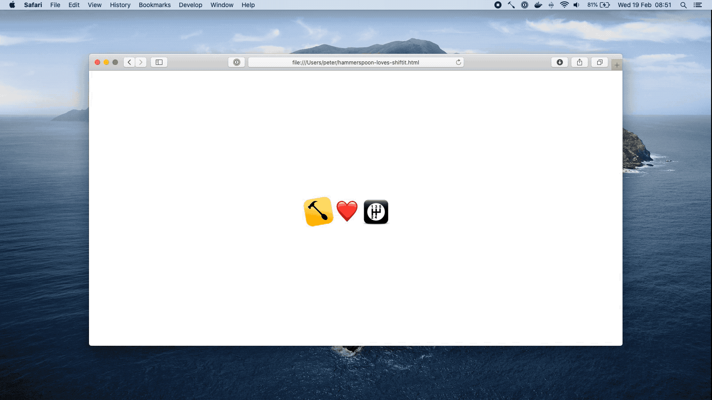
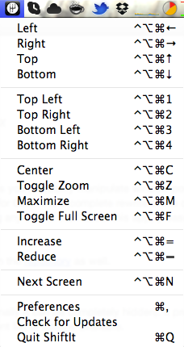
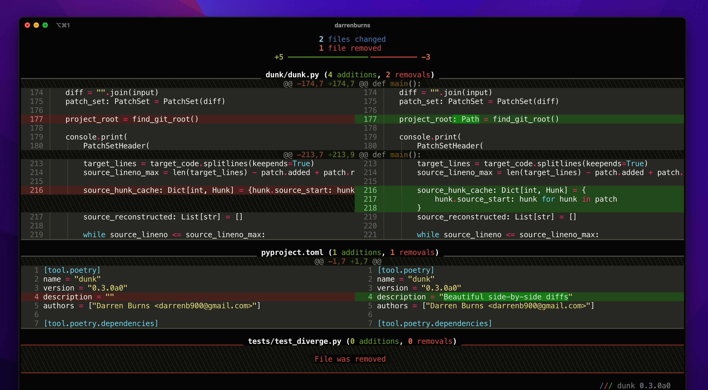
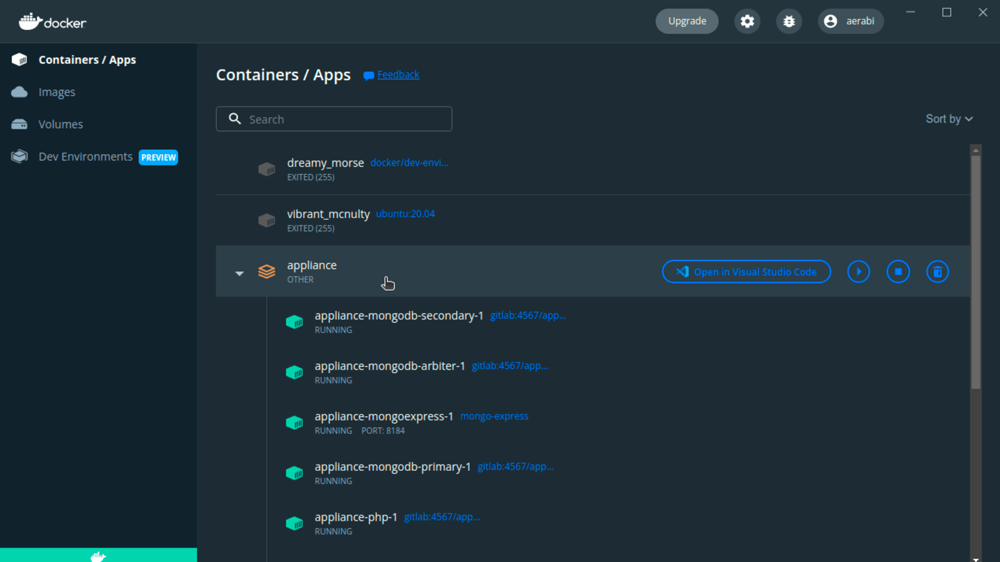
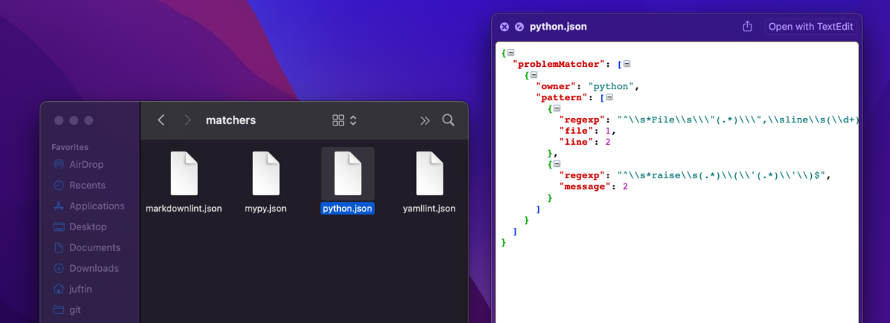
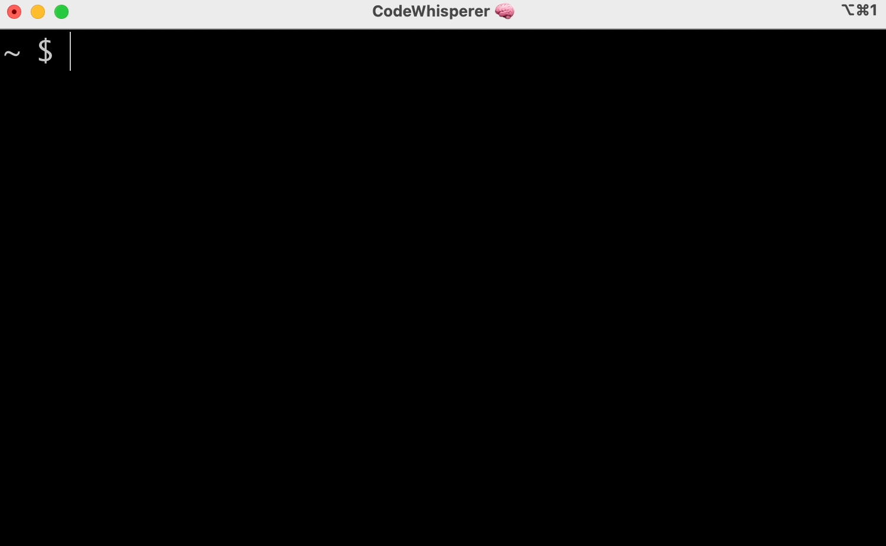
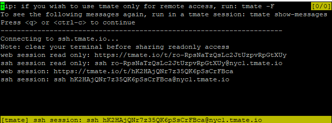

# Developer Efficiency Apps

## ShiftIt

[ShiftIt] is a tool to manage window positions using hotkeys. It's no longer
maintained but its key bindings have been ported over to an automation tool
called [HammerSpoon].

```shell
brew install hammerspoon
```

-   Download, unzip, and open the ShitIt Key Bindings for Hammerspoon
    https://github.com/peterklijn/hammerspoon-shiftit/raw/master/Spoons/ShiftIt.spoon.zip

-   Click on the Hammerspoon menubar icon and click on 'Open Config'. An init.lua file should now
    open in your editor of choice.

-   Paste the following configuration in the init.lua file, save it and close it.

    ```text
    hs.loadSpoon("ShiftIt")
    spoon.ShiftIt:bindHotkeys({})
    ```





## dunk

Install and use [dunk] for git diffs

Pipe your git diff output into dunk to make it prettier!

```shell
pipx install dunk
git config --global alias.dunk '!git diff | dunk | less -R'
```



## Docker Desktop

Install [Docker Desktop]

-   https://docs.docker.com/desktop/install/mac-install/
-   After Installation, grant Docker additional resources the Docker Desktop
    App Preferences



## Quicklook Plugins

Install QuickLook Plugins

The application offers a Quick Look Extension for macOS 10.15 Catalina
and later for previewing source files.

```shell
brew install --cask --no-quarantine syntax-highlight
```

> NOTE:
>
> To use the Quick Look preview you must launch the Application at
> least once. In this way the Quick Look Extension will be discovered
> by the system and will be available in the
> System preferences > Extensions > Quick Look.



## thefuck

Install [thefuck]

```shell
brew install thefuck
```

The Fuck is an app that corrects errors in previous console commands.

You also need to add the following to your `~/.zshrc` file:

```shell
eval "$(thefuck --alias)"
eval "$(thefuck --alias dang)"
```


## codewhisperer

Install [codewhisperer] (by AWS)

```shell
brew install --cask codewhisperer
```

[codewhisperer] (formerly known as `fig`) adds IDE-style autocomplete
to your terminal + some AI / LLM magic as well. Using `codewhisperer` requires
a free AWS builder account for personal use.

> NOTE:
>
> You must open the `CodeWhisperer` app at least once to set
> initial permissions and log in before you can use it.

-   Disable telemetry and shared data:
    ```shell
    cw settings telemetry.enabled false
    cw settings codeWhisperer.shareCodeWhispererContentWithAWS false
    ```




## httpie

Install [HTTPie]

```shell
pipx install httpie
```

[HTTPie] is a command-line HTTP client. The `http` & `https` commands allow for creating and
sending arbitrary HTTP requests. They use simple and natural syntax and provide formatted
and colorized output.


## trash-cli

Install [trash-cli]

```shell
brew install node
```

```shell
npm install --global trash-cli
```

In contrast to rm which is dangerous and permanently deletes files, this only moves them to the trash, which is much
safer and reversible.

```console
$ trash --help

  Usage
    $ trash <path|glob> […]

  Examples
    $ trash unicorn.png rainbow.png
    $ trash '*.png' '!unicorn.png'
```

## tmate

Install [tmate]

```shell
brew install tmate
```

Tmate is a fork of tmux. It provides an instant pairing solution - you can generate a secure, one-time
link to allow developers to SSH into your current terminal session.



## More Brew Apps

-   [jq]
    -   Powerful JSON Parsing
-   [htop]
    -   This is htop, a cross-platform interactive process viewer.
-   [Glances]
    -   Glances is a cross-platform system monitoring tool written in Python.
-   [Caffeine]
    -   Prevent your computer from sleeping
-   [VLC]
    -   VLC is a free and open source, cross-platform multimedia player

```shell
brew install jq
brew install glances
```

```shell
brew install --cask caffeine
brew install --cask vlc
brew install --cask htop
```

[ShiftIt]: https://github.com/peterklijn/hammerspoon-shiftit
[dunk]: https://github.com/darrenburns/dunk
[Docker Desktop]: https://www.docker.com/products/docker-desktop/
[Alfred]: https://www.alfredapp.com/
[CheatSheet]: https://www.mediaatelier.com/CheatSheet/
[VLC]: https://www.videolan.org/vlc/
[Caffeine]: https://intelliscapesolutions.com/apps/caffeine
[thefuck]: https://github.com/nvbn/thefuck
[jq]: https://stedolan.github.io/jq/
[Glances]: https://nicolargo.github.io/glances/
[htop]: https://htop.dev/
[httpie]: https://github.com/httpie/httpie
[trash-cli]: https://github.com/sindresorhus/trash-cli
[Hammerspoon]: https://github.com/Hammerspoon/hammerspoon
[tmate]: https://tmate.io/
[codewhisperer]: https://aws.amazon.com/codewhisperer/
