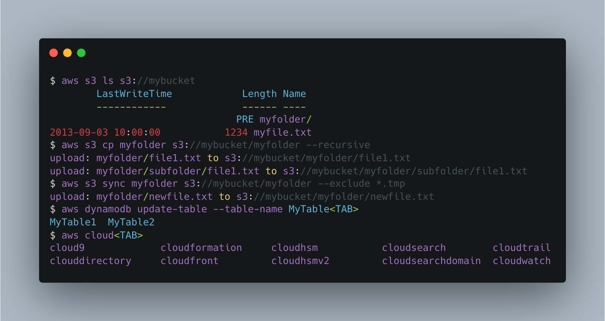

# AWS

## AWS CLI

Install [AWS CLI v2]

```shell
curl "https://awscli.amazonaws.com/AWSCLIV2.pkg" -o ~/Downloads/AWSCLIV2.pkg && open ~/Downloads/AWSCLIV2.pkg
```



## awsume

Install [awsume] and its helper, [aws-sso-util]

```shell
pipx install "awsume[console,fuzzy]"
pipx install aws-sso-util
```


[awsume] is a utility that helps you manage your AWS credentials
and easily assume roles. Along with [aws-sso-util], it can be used to
manage AWS SSO credentials and roles.

You should read the [awsume] documentation to understand how to configure it,
but here is a quick start:

1. Configure your AWS credentials file with your default profile

    ```shell
    aws configure sso
    ```

2. Set up your shell to work with `awsume` - the following command
   will add the necessary lines to your `~/.zshrc` file:

    ```shell
    awsume-configure --shell zsh --alias-file ~/.zshrc
    ```

3. Update your `~/.aws/config` file with all roles - the `aws-sso-util`
   app will detect all available:

    ```shell
    aws-sso-util configure populate --region us-east-1
    ```

4. By default, `awsume` has a role duration of 1 hour. This can be extended up
   to 12 hours (43,200 seconds), by specifying a longer role duration either
   via command line or as in the following example config:

    ```console
    $ cat ~/.awsume/config.yaml
    colors: true
    fuzzy-match: true
    role-duration: 43200
    ```

5. You should also create a default profile on your `~/.aws/config` file that
   will be used automatically when you don't provide a profile name argument to
   the awsume CLI:

    ```ini
    [profile default]
    sso_start_url = https://d-123456789.awsapps.com/start
    sso_region = us-east-1
    sso_account_name = AWS Account Name
    sso_account_id = 1234567890123
    sso_role_name = RoleName
    region = us-east-1
    credential_process = aws-sso-util credential-process --profile default
    sso_auto_populated = true
    ```

[awsume]: https://github.com/trek10inc/awsume
[aws-sso-util]: https://github.com/benkehoe/aws-sso-util
[AWS CLI v2]: https://docs.aws.amazon.com/cli/index.html
