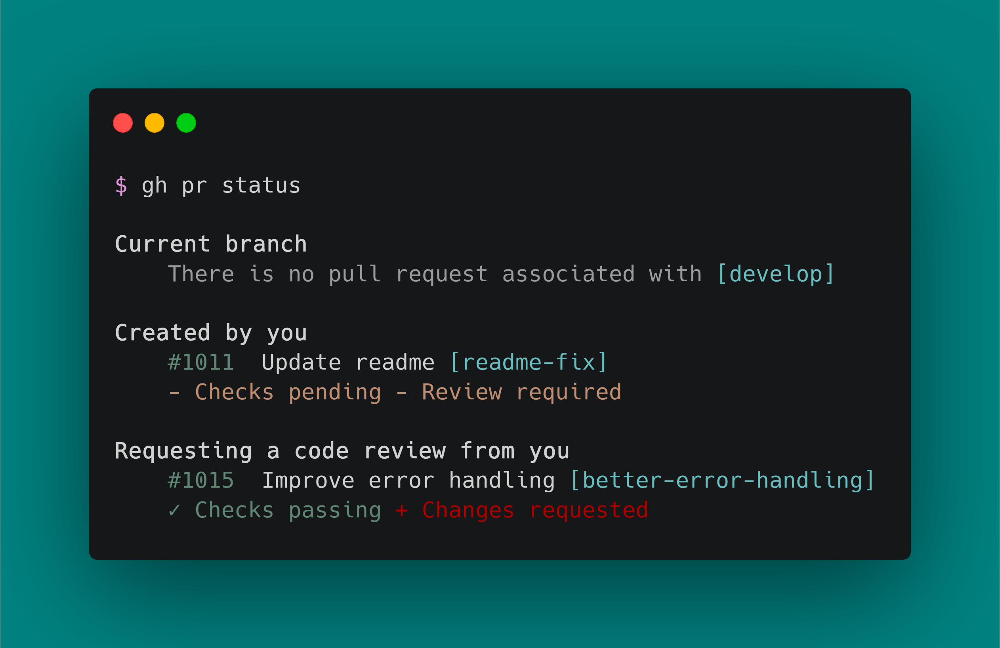

# Version Control

Install [git] and the [GitHub CLI]

```shell
brew install git
brew install gh
```



## git config

```shell
git config --global user.name "juftin"
git config --global user.email "juftin@juftin.com"
git config --global init.defaultBranch main
git config --global pull.rebase false
curl https://raw.githubusercontent.com/github/gitignore/master/Global/macOS.gitignore -o ~/.gitignore
git config --global core.excludesfile ~/.gitignore
```

```shell
gh auth login
gh auth setup-git
```

[git]: http://git-scm.com/
[GitHub CLI]: https://cli.github.com/
