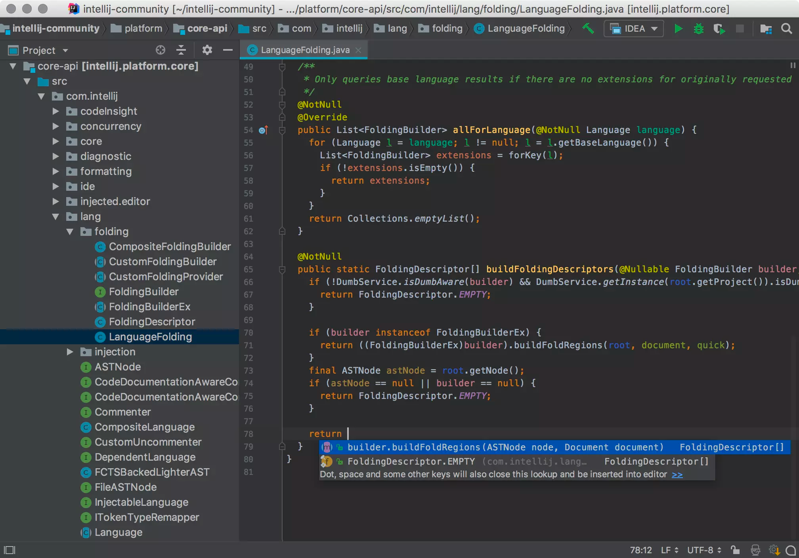
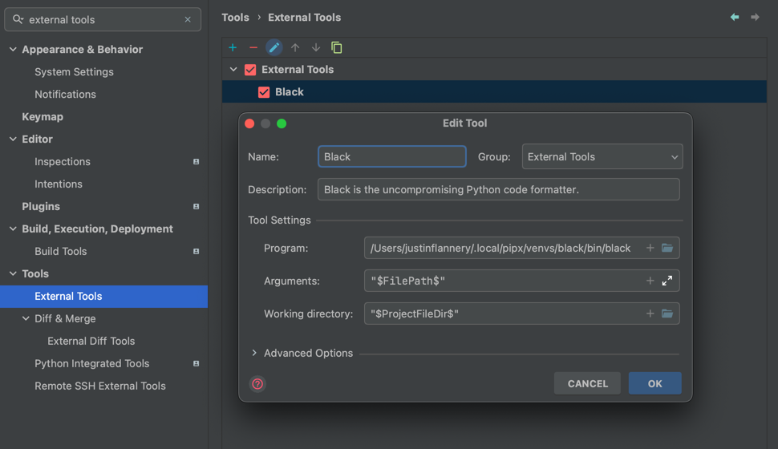

# IDE

This guide recommends the use of [JetBrains] IDE products ([IntelliJ] or [PyCharm])

Install [JetBrains] IDE of Choice:

- Download the [JetBrains Toolbox] to download and manage IDE applications



## Plugins

I like to start off by sorting JetBrains plugins by downloads. To do this I go to `Settings` -> `Plugins`
-> `Marketplace` -> `/sortBy:downloads`

### JetBrains App Functionality Plugins

- `Python`
    - https://plugins.jetbrains.com/plugin/631-python
- `Database Tools and SQL`
    - https://www.jetbrains.com/datagrip/features/

### JetBrains Productivity Plugins

- `.ignore`
    - https://plugins.jetbrains.com/plugin/7495--ignore
- `Material Theme UI`
    - https://plugins.jetbrains.com/plugin/8006-material-theme-ui
- `CSV`
    - https://plugins.jetbrains.com/plugin/10037-csv
- `Rainbow Brackets`
    - https://plugins.jetbrains.com/plugin/10080-rainbow-brackets
- `.env files support`
    - https://plugins.jetbrains.com/plugin/9525--env-files-support
- `Toml`
    - https://plugins.jetbrains.com/plugin/8195-toml
- `SonarLint`
    - https://plugins.jetbrains.com/plugin/7973-sonarlint
- `Atom Material Icons`
    - https://plugins.jetbrains.com/plugin/10044-atom-material-icons
- `GitToolBox`
    - https://plugins.jetbrains.com/plugin/7499-gittoolbox
- `Requirements`
    - https://plugins.jetbrains.com/plugin/10837-requirements
- `ReStructuredText`
    - https://plugins.jetbrains.com/plugin/7124-restructuredtext
- `BigDataTools`
    - https://plugins.jetbrains.com/plugin/12494-big-data-tools
- `Pydantic`
    - https://plugins.jetbrains.com/plugin/12861-pydantic
- Foldable Project View

### Pre-Installed Productivity Plugins

- `Markdown`
    - https://plugins.jetbrains.com/plugin/7793-markdown
- `Docker`
    - https://plugins.jetbrains.com/plugin/7724-docker
- `Ini`
    - https://plugins.jetbrains.com/plugin/6981-ini
- `EditorConfig`
    - https://plugins.jetbrains.com/plugin/7294-editorconfig
- `Properties`
    - https://plugins.jetbrains.com/plugin/11594-properties

## Settings Files

There is a zip file at [jetbrains/settings.zip](jetbrains/settings.zip) that contains the
base settings for JetBrains IDEs. See the
[JetBrains Documentation](https://www.jetbrains.com/help/idea/sharing-your-ide-settings.html) for more information.

## JetBrains Settings

Most of these settings can be imported from the [jetbrains/settings.zip](jetbrains/settings.zip) file.

### Git Commit UI

Use the traditional Git Commit UI

`IDE Setting` -> `Version Control` -> `Commit` -> `Use non-modal commit interface`

### KeyMap

These KeyMap settings are done with a full-length desktop keyboard in mind.

- `F19`: `Run File in Python Console`
- `F16`: `Refactor: Rename`
    - This is in addition to the default (`⇧` + `F6`) keymap
- (`⌘` + `⇧` + `P`): Git Pull

Default Keymaps Worth Mentioning:

- (`⌘` + `⇧` + `K`): Git Commit
- (`⌥` + `⌘` + `L`): Reformat Code
- (`⌘` + `B`): Jump to Usages / Definition

### Reformat Files with Black

Black is an auto-formatter for Python code. It's non-customizable
by design. Blackened code looks the same regardless of the project you're reading. Formatting becomes transparent after
a while and you can focus on the content instead.

Install [Black]

```shell
pipx install "black[jupyter]"
```

[Setup JetBrains IDE to use Black](https://black.readthedocs.io/en/stable/integrations/editors.html#pycharm-intellij-idea)

I also recommend adding a keymap at `F13` for running Black.



[Black]: https://github.com/psf/black
[JetBrains]: https://www.jetbrains.com/
[IntelliJ]: https://www.jetbrains.com/idea/
[PyCharm]: https://www.jetbrains.com/pycharm/
[JetBrains Toolbox]: https://www.jetbrains.com/toolbox-app/
