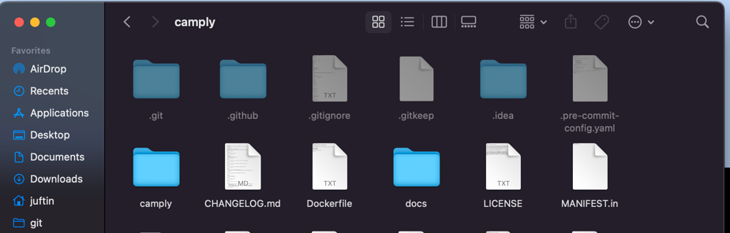

# Mac Settings

## Show Hidden Files

Show hidden files inside the `finder` app

```shell
defaults write com.apple.finder AppleShowAllFiles True; killall Finder
```



## Screenshots Directory

Set new default screenshot Dir

```shell
mkdir ~/Screenshots
defaults write com.apple.screencapture location ~/Screenshots/ && killall SystemUIServer
```

## Workplace Auto Switch

Disable Workspace Auto Switching

```shell
defaults write com.apple.dock workspaces-auto-swoosh -bool NO
killall Dock
```
