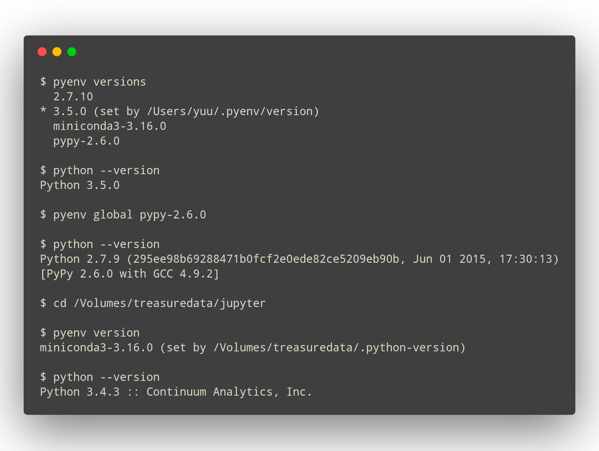
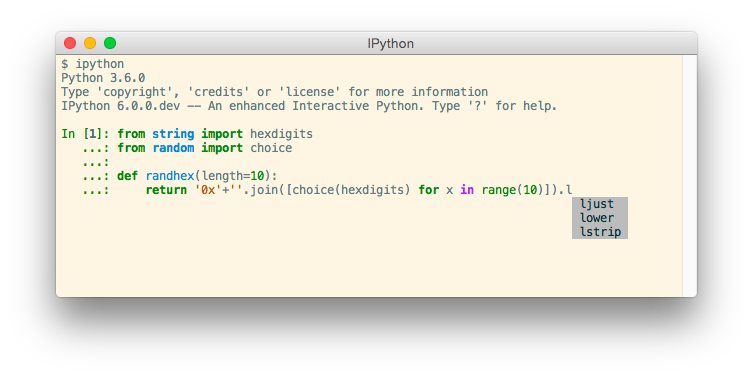

# Python

Install and manage python versions using [pyenv].

## pyenv

This process uses [pyenv] to manage Python installation and versions. [pyenv] is a Python
version manager that can manage and install different versions of Python.

Install [pyenv] with [Homebrew](Homebrew)

```shell
brew install pyenv
```

Run the following lines to update your dot files, informing them to use [pyenv] to manage Python

```shell
echo 'export PYENV_ROOT="$HOME/.pyenv"' >> ~/zshrc.zsh
echo 'command -v pyenv >/dev/null || export PATH="$PYENV_ROOT/bin:$PATH"' >> ~/zshrc.zsh
echo 'eval "$(pyenv init -)"' >> ~/zshrc.zsh
echo 'export PYENV_ROOT="$HOME/.pyenv"' >> ~/.zprofile
echo 'command -v pyenv >/dev/null || export PATH="$PYENV_ROOT/bin:$PATH"' >> ~/.zprofile
echo 'eval "$(pyenv init -)"' >> ~/.zprofile
exec "$SHELL"
```

Install additional dependencies required to build Python

```shell
brew install openssl readline sqlite3 xz zlib tcl-tk
```

```shell
pyenv install 3.10.5
pyenv install 3.9.5
pyenv install 3.8.13
pyenv install 3.7.13
pyenv global 3.9.5 3.10.5 3.8.13 3.7.13
pyenv rehash
```



## IPython

Install [IPython]

```shell
pip install 'ipython[zmq,qtconsole,notebook,test]'
```



## pipx

Install [pipx]

pipx is a tool to help you install and run end-user applications written in
Python. It's roughly similar to macOS's brew, JavaScript's npx, and
Linux's apt.

It's closely related to pip. In fact, it uses pip, but is focused on installing
and managing Python packages that can be run from the command line directly as
applications.

```shell
brew install pipx
pipx ensurepath
```


[Python]: https://python.org/
[pipx]: https://github.com/pypa/pipx
[pyenv]: https://github.com/yyuu/pyenv
[IPython]: http://ipython.org/
