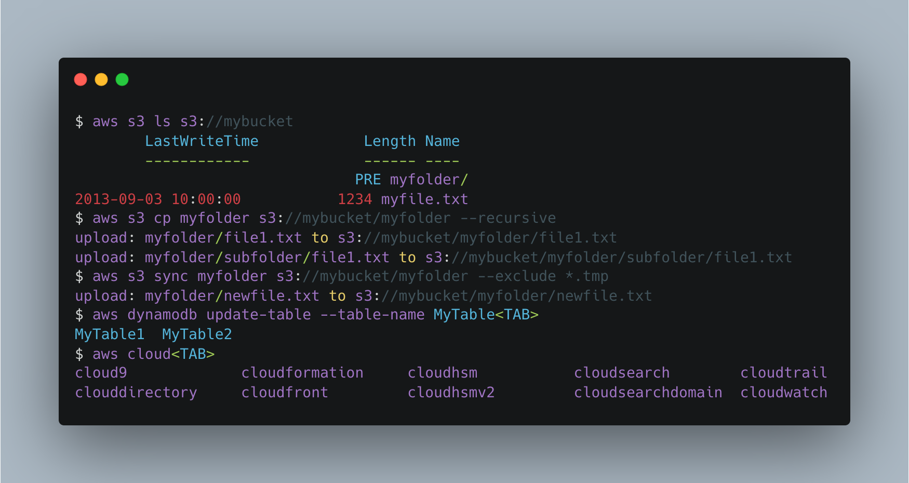
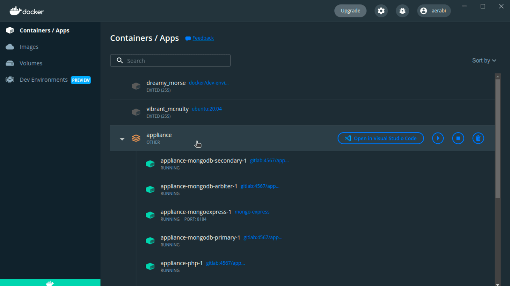
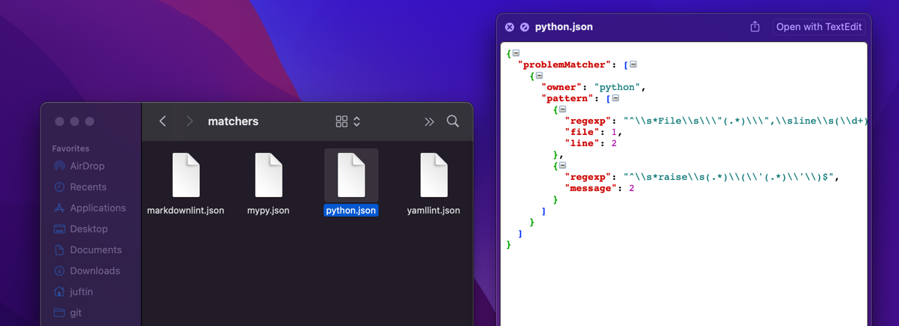
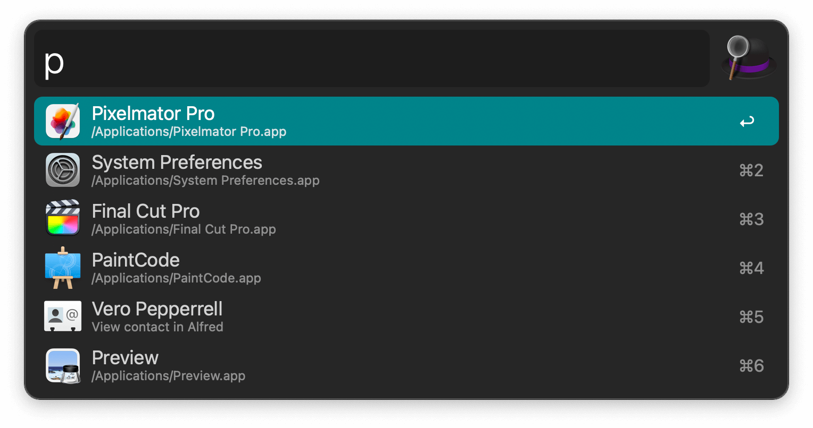
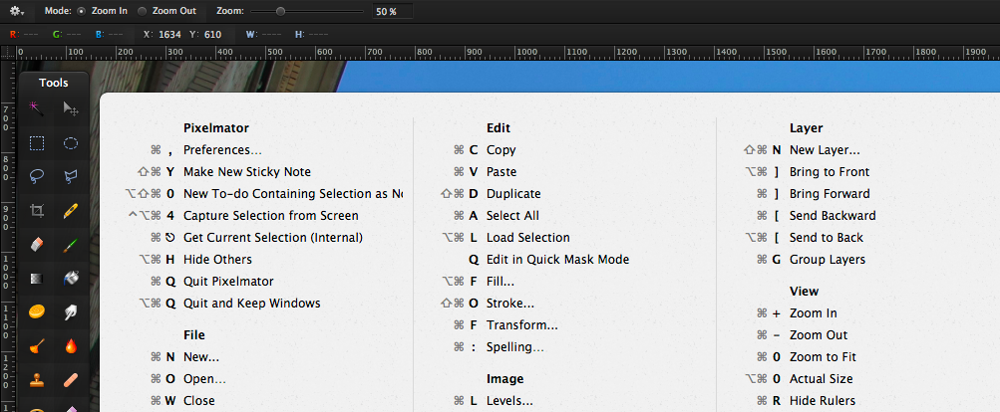

# Developer Efficiency Apps

## ShiftIt

[ShiftIt] is a tool to manage window positions using hotkeys. It's no longer
maintained but its key bindings have been ported over to an automation tool
called [HammerSpoon].

```shell
brew install hammerspoon
```

- Download, unzip, and open the ShitIt Key Bindings for Hammerspoon
  https://github.com/peterklijn/hammerspoon-shiftit/raw/master/Spoons/ShiftIt.spoon.zip

- Click on the Hammerspoon menubar icon and click on 'Open Config'. An init.lua file should now
  open in your editor of choice.

- Paste the following configuration in the init.lua file, save it and close it.

    ```text
    hs.loadSpoon("ShiftIt")
    spoon.ShiftIt:bindHotkeys({})
    ```


## AWS CLI

Install [AWS CLI v2]

```shell
curl "https://awscli.amazonaws.com/AWSCLIV2.pkg" -o ~/Downloads/AWSCLIV2.pkg && open ~/Downloads/AWSCLIV2.pkg
```



## dunk

Install and use [dunk] for git diffs

Pipe your git diff output into dunk to make it prettier!

```shell
pipx install dunk
git config --global alias.dunk '!git diff | dunk | less -R'
```


## Docker Desktop

Install [Docker Desktop]

- https://docs.docker.com/desktop/install/mac-install/
- After Installation, grant Docker additional resources the Docker Desktop
  App Preferences



## Quicklook Plugins

Install QuickLook Plugins

These plugins add support for the corresponding file type to Mac Quick Look (In Finder, mark a
file and press Space to start Quick Look). The plugins includes features like syntax
highlighting, Markdown rendering, preview of JSON, patch files, CSV, ZIP files and more.

```shell
brew install --cask \
    qlcolorcode \
    qlstephen \
    qlmarkdown \
    quicklook-json \
    qlprettypatch \
    quicklook-csv \
    betterzip \
    webpquicklook \
    suspicious-package
```



## Alfred

Install [Alfred]

```shell
brew install --cask alfred
```

Alfred is an app which boosts your efficiency with hotkeys, keywords, text expansion
and more. Search your Mac and the web, and be more productive with custom actions
to control your Mac.

- Add a (`^` + `⌥` + `⌘` + `[space]`) keyboard shortcut



## CheatSheet

Install [CheatSheet]

```shell
brew install --cask cheatsheet
```

Hold `⌘` Key a bit longer to get a list of all active shortcuts of the current
application



## thefuck

Install [thefuck]

```shell
brew install thefuck
```
The Fuck is an app that corrects errors in previous console commands.


## fig

Install [fig]

- https://fig.io/download

[fig] adds IDE-style autocomplete to your existing terminal

- Disable telemetry:
  ```shell
  fig settings telemetry.disabled true
  ```


## httpie

Install [HTTPie]

```shell
pipx install httpie
```

[HTTPie] is a command-line HTTP client. The `http` & `https` commands allow for creating and
sending arbitrary HTTP requests. They use simple and natural syntax and provide formatted
and colorized output.


## trash-cli

Install [trash-cli]

```shell
brew install node
```

```shell
npm install --global trash-cli
```

In contrast to rm which is dangerous and permanently deletes files, this only moves them to the trash, which is much
safer and reversible.

```console
$ trash --help

  Usage
    $ trash <path|glob> […]

  Examples
    $ trash unicorn.png rainbow.png
    $ trash '*.png' '!unicorn.png'
```

## More Brew Apps

- [jq]
    - Powerful JSON Parsing
- [htop]
    - This is htop, a cross-platform interactive process viewer.
- [Glances]
    - Glances is a cross-platform system monitoring tool written in Python.
- [Caffeine]
    - Prevent your computer from sleeping
- [VLC]
    - VLC is a free and open source, cross-platform multimedia player

```shell
brew install jq
brew install glances
```

```shell
brew install --cask caffeine
brew install --cask vlc
brew install --cask htop
```

[ShiftIt]: https://github.com/peterklijn/hammerspoon-shiftit
[AWS CLI v2]: https://docs.aws.amazon.com/cli/index.html
[dunk]: https://github.com/darrenburns/dunk
[Docker Desktop]: https://www.docker.com/products/docker-desktop/
[Alfred]: https://www.alfredapp.com/
[CheatSheet]: https://www.mediaatelier.com/CheatSheet/
[VLC]: https://www.videolan.org/vlc/
[Caffeine]: https://intelliscapesolutions.com/apps/caffeine
[fig]: https://fig.io
[thefuck]: https://github.com/nvbn/thefuck
[jq]: https://stedolan.github.io/jq/
[Glances]: https://nicolargo.github.io/glances/
[htop]: https://htop.dev/
[httpie]: https://github.com/httpie/httpie
[trash-cli]: https://github.com/sindresorhus/trash-cli
[Hammerspoon]: https://github.com/Hammerspoon/hammerspoon
