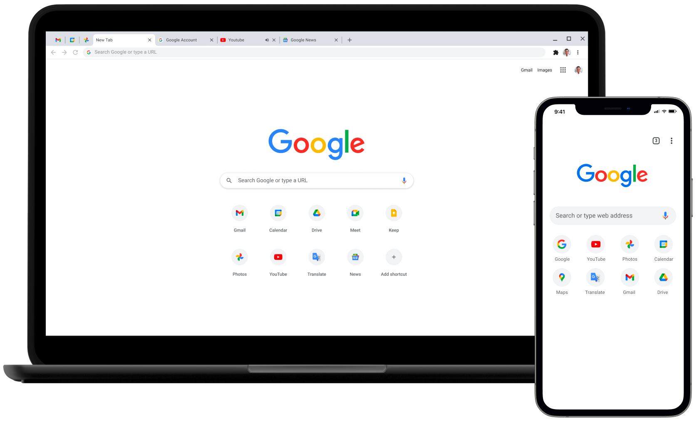
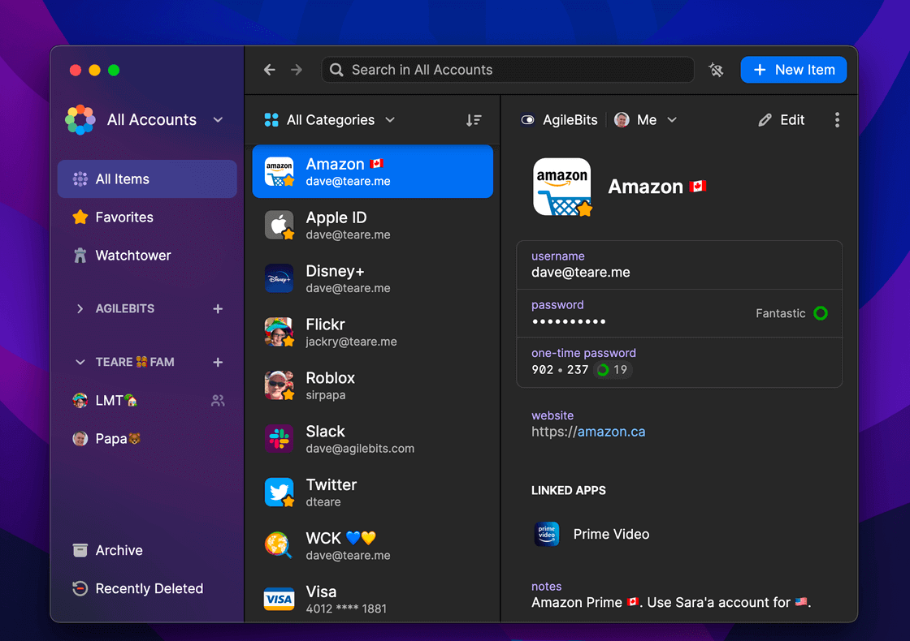

# Initial Settings and Applications

## Initial Settings

### Trackpad & Mouse

- `Point & Click`
    - Enable `Tap to click with one finger`
    - Change `Secondary click` to `Right corner`
    - Uncheck `Three Finger Drag`
- `Scroll & Zoom`
    - Uncheck `all` apart from `Zoom in and out`
    - Uncheck `Scolling girection: natural`

### General Settings

- Enable Dark Mode
    - `System Preferences` -> `General`
- Disable Recent Apps in Dock
    - `System Preferences` -> `Dock & Menu Bar` -> Uncheck `Show recent applications in dock`

## Initial Applications

### Google Chrome

Download and install [Google Chrome] Web Browser

- https://www.google.com/chrome/downloads/

### 1Password

Download and install [1Password]

- https://1password.com/downloads/mac/

[Google Chrome]: https://google.com/chrome
[1Password]: https://1password.com/
