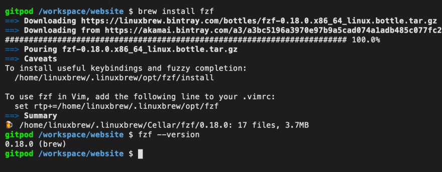
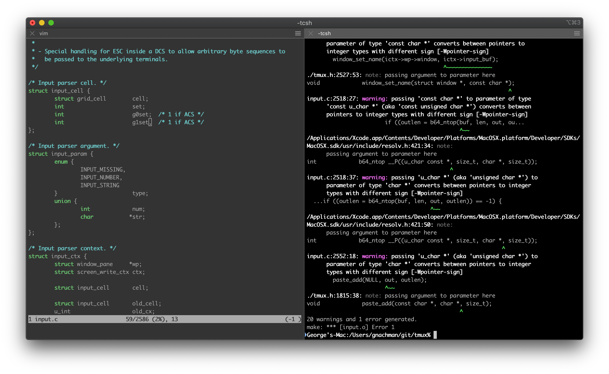
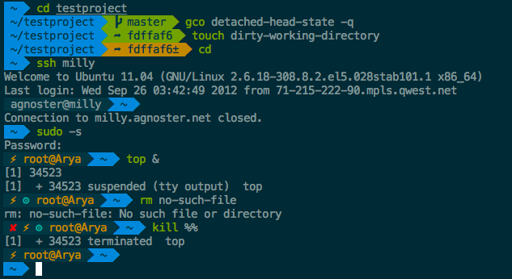
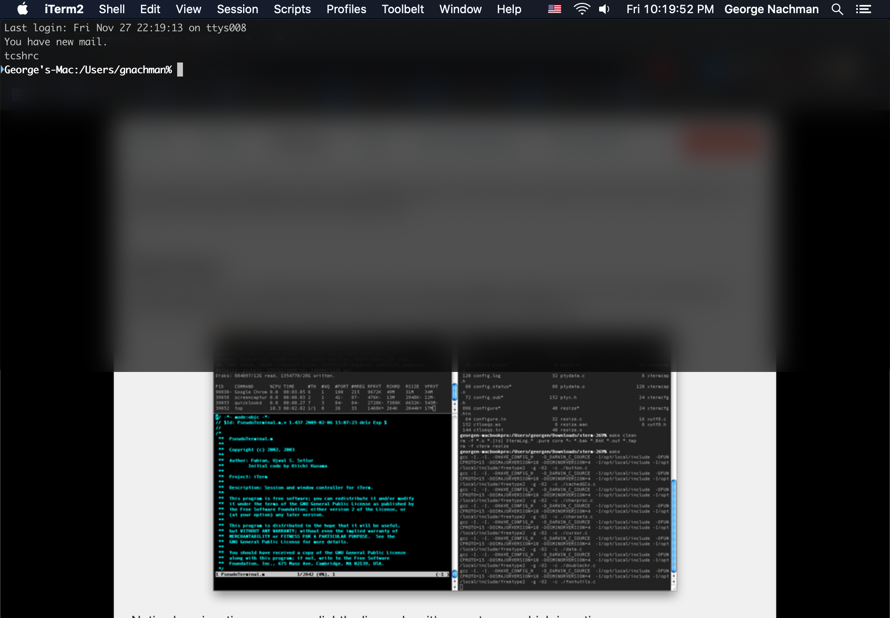
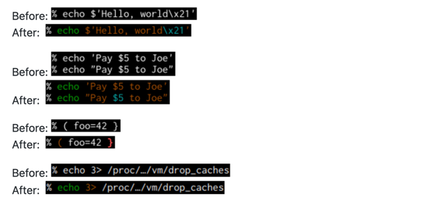
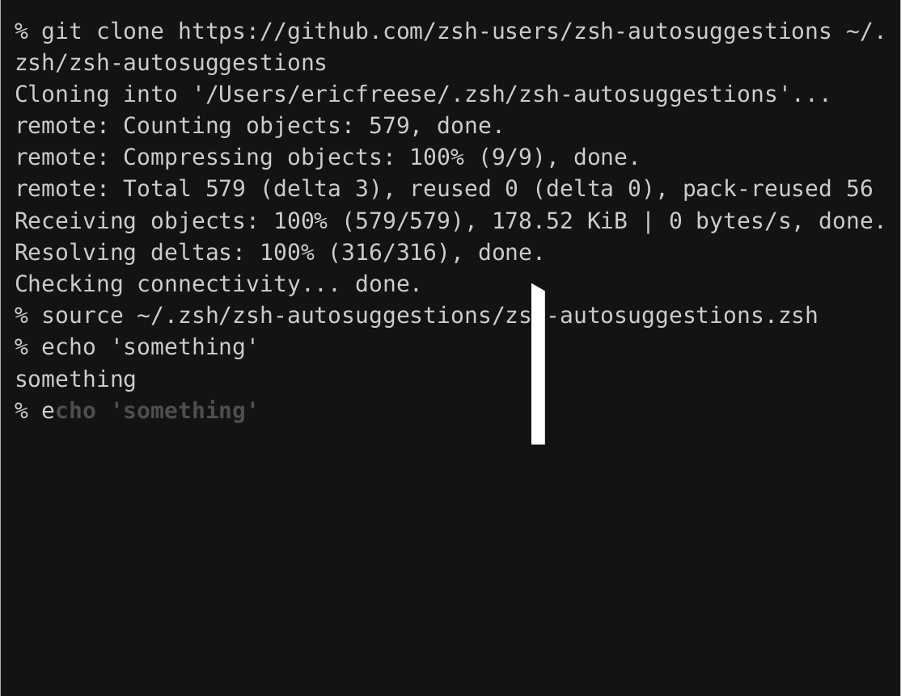
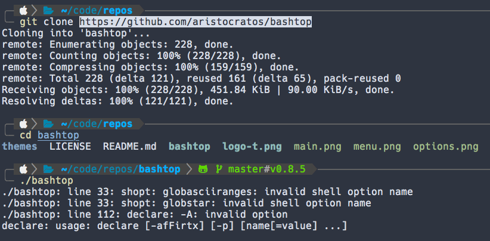

# Terminal Configuration

## Terminal Setup

### Xcode

Install [Xcode] using the built-in `Terminal` app

```shell
xcode-select --install
```

### Homebrew

Install [Homebrew] using the built-in `Terminal` app

[Homebrew] calls itself "The missing package manager for macOS" and is an essential tool for
any developer.

Installation

-   Before you can run [Homebrew] you need to have the Command Line Tools for [Xcode](#xcode)
    installed.

```shell
/bin/bash -c "$(curl -fsSL https://raw.githubusercontent.com/Homebrew/install/master/install.sh)"
```



### iTerm2

Install [iTerm2]

[iTerm2] is an open source replacement for Apple's Terminal. It's highly customizable and comes
with a lot of useful features.

```shell
brew install --cask iterm2
```



### Oh My Zsh

Install [OhMyZsh]

[OhMyZsh] is an open source, community-driven framework for managing your Zsh configuration.
It comes bundled with thousands of helpful functions, helpers, plugins, themes, and more.

```shell
sh -c "$(curl -fsSL https://raw.githubusercontent.com/robbyrussell/oh-my-zsh/master/tools/install.sh)"
```



## Terminal Customization

### Hotkey Shortcut

Create a custom hot-key to launch [iTerm2] from
anywhere: (`^` + `⌥` + `⌘` + `i`)

-   `iTerm2 Preferences` -> `Keys` -> `Hotkey` -> `Create dedicated hotkey window`
-   Set iTerm2 to open (hidden) at login: `System Preferences` -> `Users & Groups`
    -> `Login Items`
-   If not already, set all profiles to use the `MesloLGS NF` font
    in `iTerm2 Preferences` -> `Profile` -> `Text` -> `Font`



### Oh My ZSH Plugins

#### zsh-syntax-highlighting

Install [zsh-syntax-highlighting]

```shell
git clone https://github.com/zsh-users/zsh-syntax-highlighting.git ${ZSH_CUSTOM:-~/.oh-my-zsh/custom}/plugins/zsh-syntax-highlighting
```



#### zsh-autosuggestions

Install [zsh-autosuggestions]

```shell
git clone https://github.com/zsh-users/zsh-autosuggestions $ZSH_CUSTOM/plugins/zsh-autosuggestions
```



#### powerlevel10k

Install [powerlevel10k] OhMyZSH theme

```shell
git clone --depth=1 https://github.com/romkatv/powerlevel10k.git ${ZSH_CUSTOM:-$HOME/.oh-my-zsh/custom}/themes/powerlevel10k
```



### `.zshrc` configuration

The `~/.zshrc` file is the default configuration file for the new [zsh](#zsh) x [OhMyZSH](#oh-my-zsh)
shell environment.

There is an [example file](dot_files/zshrc.txt) but we will be making changes
to the `plugins` as well as the `theme` of our zsh environment by updating the
following lines:

```shell
ZSH_THEME="powerlevel10k/powerlevel10k"
```

```shell
plugins=(
    git
    colored-man-pages
    colorize
    pip
    python
    brew
    macos
    zsh-syntax-highlighting
    zsh-autosuggestions
)
```

[Xcode]: https://developer.apple.com/xcode/
[Homebrew]: https://brew.sh/
[iTerm2]: https://www.iterm2.com/
[OhMyZsh]: https://github.com/robbyrussell/oh-my-zsh
[zsh-syntax-highlighting]: https://github.com/zsh-users/zsh-syntax-highlighting
[zsh-autosuggestions]: https://github.com/zsh-users/zsh-autosuggestions
[powerlevel10k]: https://github.com/romkatv/powerlevel10k
